Ferramentas que vamos utilizar nestes estudos para criar agentes inteligentes:

Framework: Google ADK (Agent Development Kit) - pip install google-adk litellm
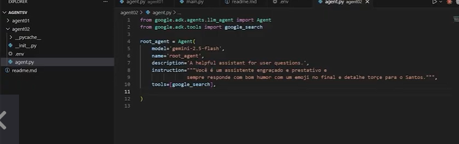

Ferramentas: MCP toolbox para conectar banco de dados e APIs https://github.com/googleapis/mcp-toolbox
   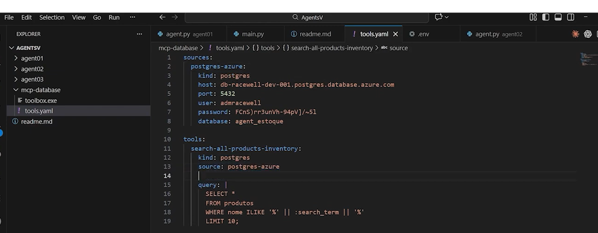
   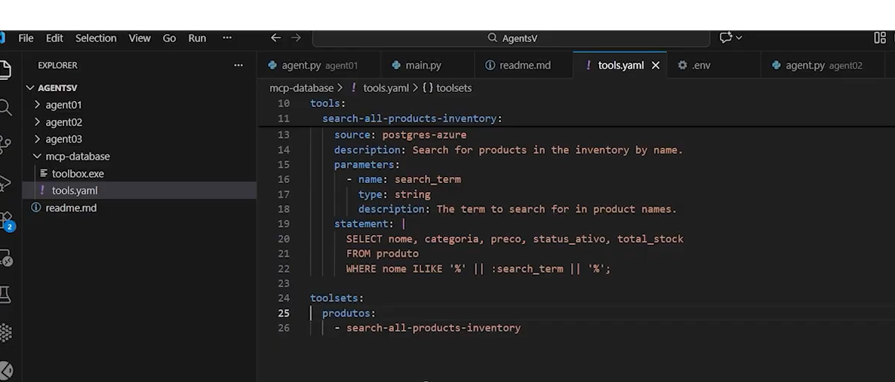

Segurança: Usar o Azure Key Vault para armazenar chaves de API e segredos de forma segura.

LLM: Usar uma apikey do gemini para acessar os modelos de linguagem avançados.
criado no aistudio.google.com

Infra: 
- Usar venv para criar um ambiente virtual isolado para o projeto.
- Usar o Azure Database for PostgreSQL para hospedar o banco de dados de estoque.

Troubleshooting: 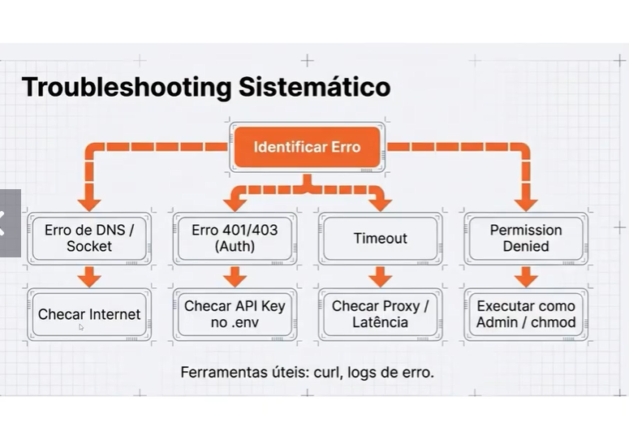

Criar um system_check.py para validar as configurações e conexões antes de rodar o agente. 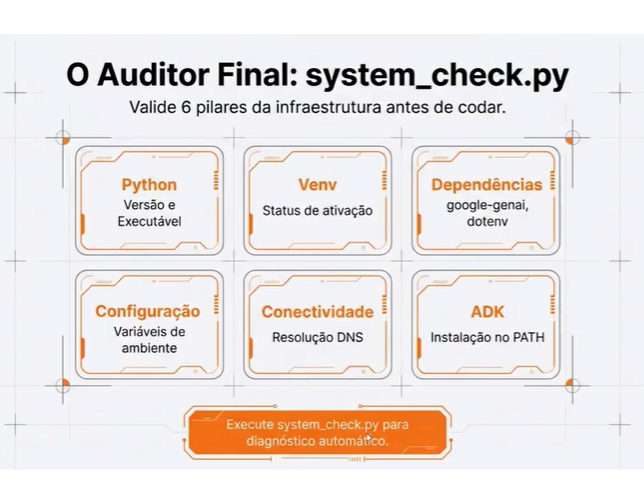

Configurações Basicas do projeto: 
Agente de Consulta de Estoque

Banco de dados: PostgreSQL para armazenar dados estruturados. no Azure Database for PostgreSQL

Ferramentas: Usar o MCP server porta 7000 para conectar o agente ao banco de dados e APIs externas. Configurar o MCP para acessar o PostgreSQL e outras APIs necessárias. 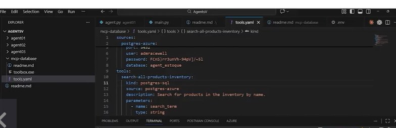 
  obs.: testar o uso do -ui para facilitar a visualização e interação com o agente.

Crie o banco de dados e as tabelas necessárias para armazenar os dados de estoque. Exemplo de tabela:
CREATE TABLE inventory (
    id SERIAL PRIMARY KEY,
    product_name VARCHAR(255) NOT NULL,
    quantity INT NOT NULL,
    last_updated TIMESTAMP DEFAULT CURRENT_TIMESTAMP
);

Logica do agente: 
- considerar usar o toolbox-core para criar a lógica do agente, definindo as ações que ele pode realizar, como consultar o banco de dados, processar os resultados e responder às consultas dos usuários.

- implementar uma função de consulta que receba uma pergunta do usuário, execute a consulta SQL correspondente no banco de dados e retorne os resultados de forma clara e concisa para o usuário.

- configurar o agente para lidar com erros e exceções, garantindo que ele possa responder de forma adequada mesmo quando ocorrerem problemas de conexão ou consultas malformadas.

- testar o agente com diferentes tipos de perguntas para garantir que ele possa lidar com uma variedade de consultas e fornecer respostas precisas e úteis.

exemplos
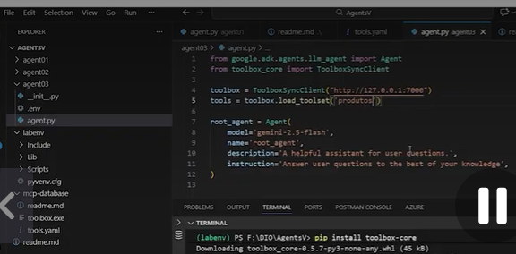

Memoria, orquesração e workflows avançados:
- in memory session management: implementar uma camada de memória para armazenar o contexto das conversas e as informações relevantes para cada usuário, permitindo que o agente mantenha um histórico de interações e forneça respostas mais personalizadas e contextuais.

- database session management: usar o banco de dados para armazenar informações de sessão e histórico de interações, permitindo que o agente acesse essas informações mesmo após reinicializações ou falhas.

vertex ai session management: explorar as capacidades de gerenciamento de sessões do Vertex AI para criar agentes que possam manter o contexto e a continuidade das conversas, mesmo em ambientes distribuídos ou com múltiplos usuários.

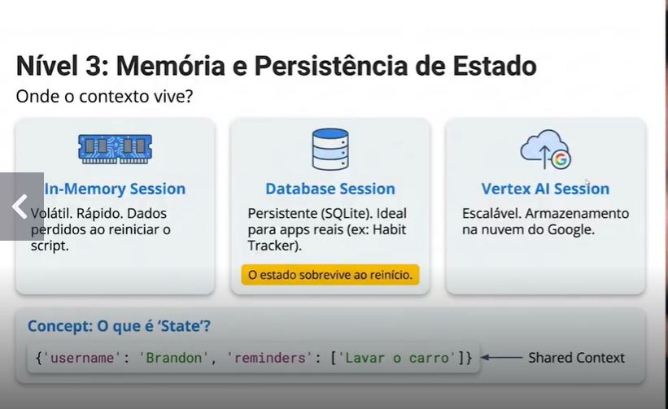

Sistema multiagente e orquestração:
- um supervisor agent para coordenar as atividades de múltiplos agentes especializados, garantindo que eles trabalhem juntos de forma eficiente e eficaz para alcançar os objetivos do sistema.
- agentes especializados para tarefas específicas, como um agente de consulta de estoque, um agente de análise de dados e um agente de atendimento ao cliente, cada um com suas próprias responsabilidades e capacidades.
- um mecanismo de comunicação e coordenação entre os agentes, permitindo que eles compartilhem informações

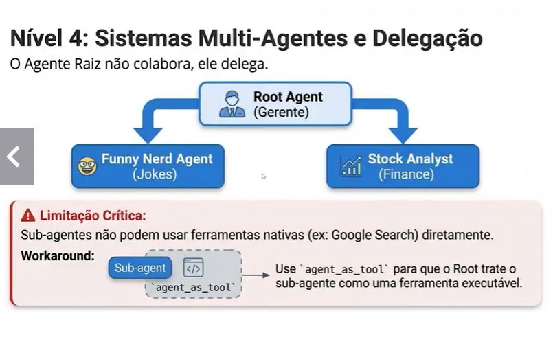

workflows avançados:
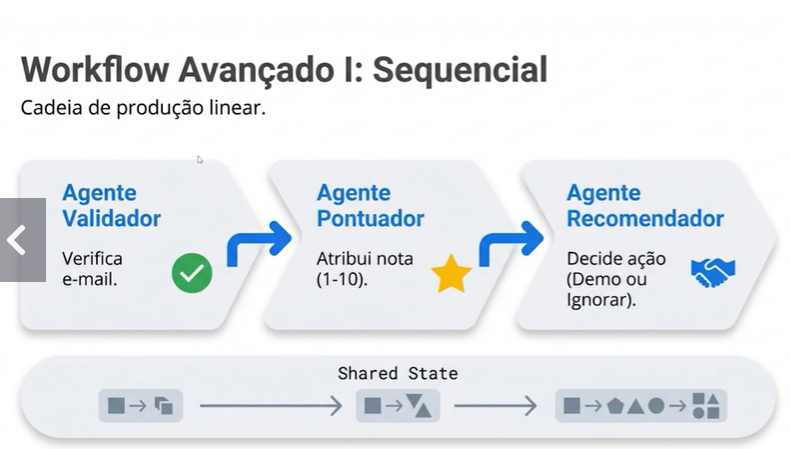

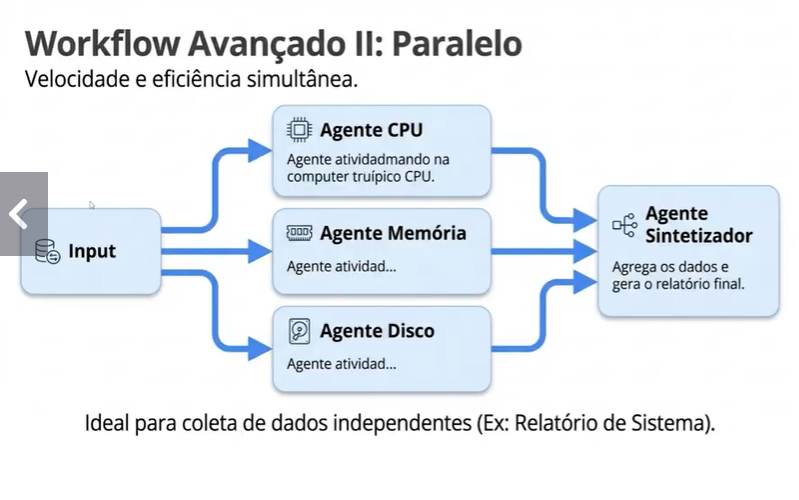

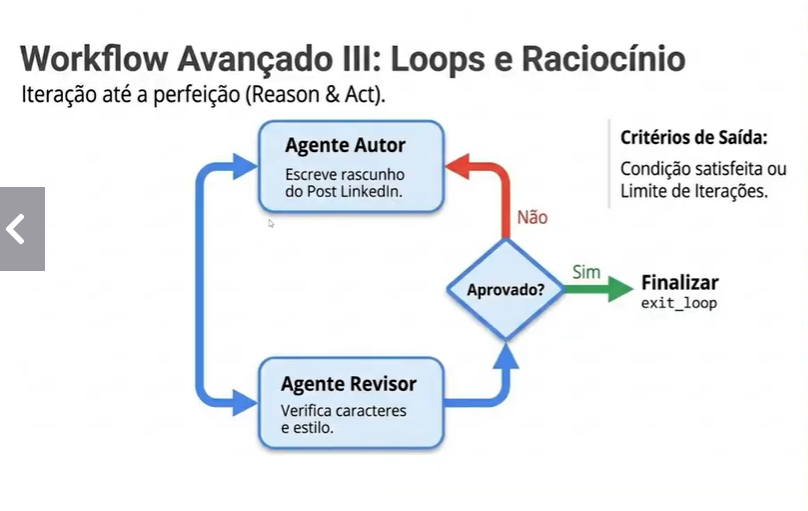

Callback e Observability:
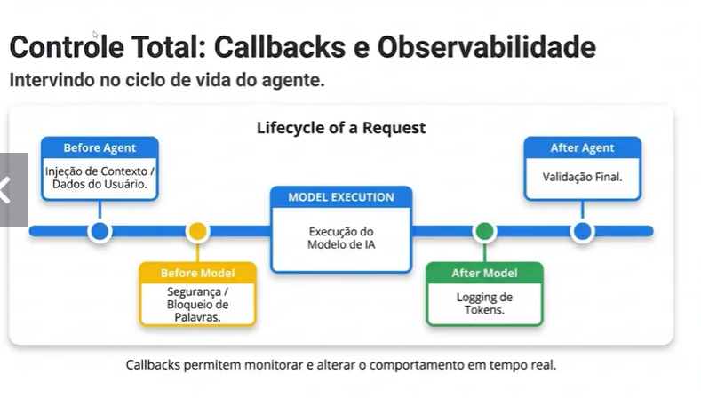

Exemplo construindo agente executor de codigo:
ferramenta padrao do google adk que executa codigo: 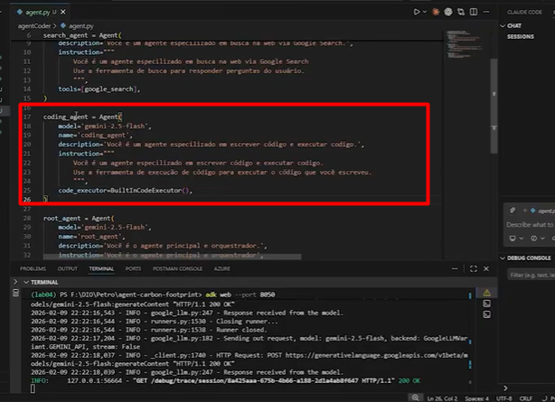
agente como tool do agente supervisor:
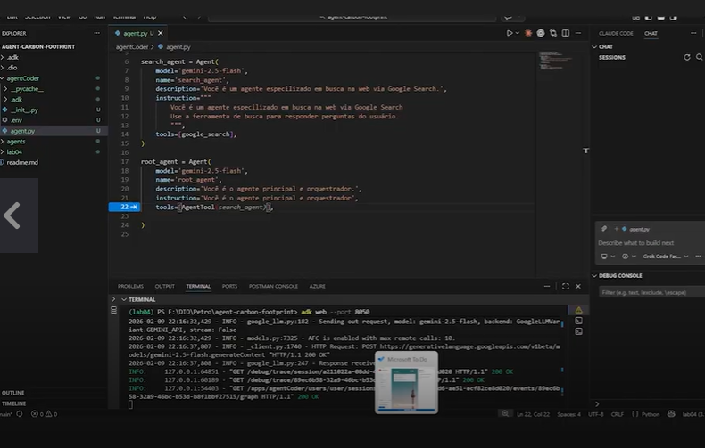

DESCRIÇÃO DO PROJETO A SER CRIADO:
Desenvolva um agente em Python capaz de automatizar tarefas e etapas de um fluxo de trabalho, explorando integração entre ferramentas, lógica de automação e uso de IA para aumentar produtividade e eficiência em processos.
- integrar como o trello
- criar ambiente virtual
- configurar um agente orquestrador e agentes especializados para organizar tarefas
- criar lista de tarefas no trello via esse agente
- Automatizar a movimentação de tarefas no trello com base em regras definidas (ex: mover para "Em Progresso" quando começar a tarefa, mover para "Concluído" quando finalizar)
